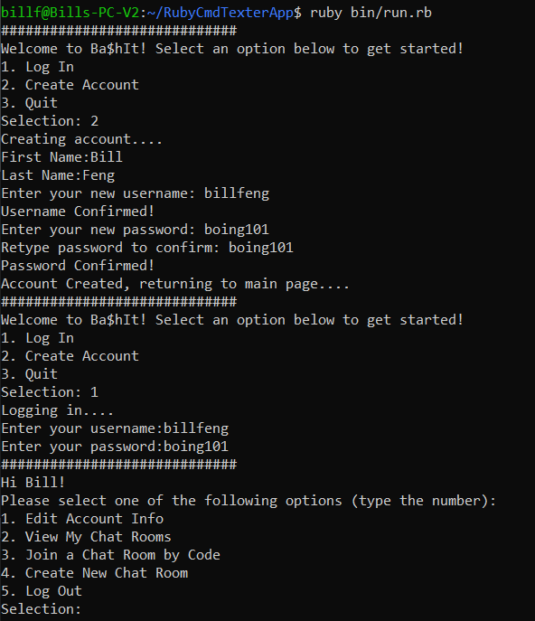

# BashIt ReadMe
---


BashIt is a high performance Command Line interface that offers a state-of-the-art messaging service using Object Orientation Programming.

* **Multi-room support** and **interactive chatroom**.
* **On demand** user/chat statistics <you can further elaborate with time stamps and what not>
  or another CI system to know if a pull request adds a massive dependency.
* **Modular** to fit different various use cases: connect with staff and faculty; enjoy conversations with friends.
* **Easy-to-use** menu interface
* Includes simple database debugging tools

<p align="center">
  
</p>

With **Active Record**, BashIt will handle complex user/room relationships. The database contains four tables, which ensure that your data is saved and properly processed.


## How It Works

BashIt is a CLI tool that runs off of Active Record and Rake. Simply run rake app inside app/models directory to activate tool.


## Usage

### Chat Applications

Suitable for applications that run on lightweight platforms and offers a solid, persistant solution to chat logs.

<summary><b>How to run</b></summary>

1. Clone this repo:

    ```sh
    $ git clone git@github.com:billfeng2002/RubyCmdTexterApp.git
    ```
    
2. Open the ```RubyCmdTexterApp``` folder and run

    ```sh
    ruby bin/run.rb
    ```
 
   which will automatically install dependencies through bundler and start the program. Simply follow the prompts afterwards

3. In the case of gem issues, run ```bundle install``` manually to install gem dependencies and then try running again. Also, try deleting the ```Gemfile.lock``` and reinstalling dependencies.
<summary><b>How to use the debugger</b></summary>

  * To reseed the database, run ```rake db:seed```

  * To enter debugging mode, run ```rake console```

  * Alternatively, run ```rake app``` to start the app

## Important App Functionality

* Users have a username and password used for login

  * The username is unique, and is used for a user's identification

  * The username cannot be changed, but a user's name can

* When users create a chat, they are assigned as the room's owner

  * Only room owners can change the settings of the room, after selecting the room

  * Owners can add/remove members, delete the chat, or change the room name and password. The room code cannot be changed.

* Messages cannot be deleted, and remain in a group chat even if a user leaves or is kicked

  * Messages are stored permanently, for auditing and moderation purposes, even if the room is deleted.

* The chat room can be configured to display any positive integer number of messages

  * ```.config 100``` will show the most recent messages in the chatroom

  * Pressing the ```return``` key will update the chat room, and typing ```quit``` will exit the chatroom


